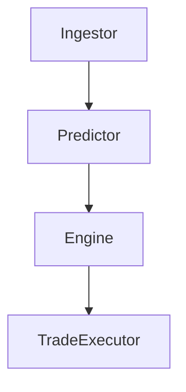

# SmartMindAI

SmartMindAI is an autonomous trading agent inspired by behavioral clustering of high-performing Solana wallets.

## Architecture



## Features

- Real-time trade prediction using statistical signal scores
- Modular design for autonomous agents
- Logging and analytics ready

## Setup

```bash
pip install -r requirements.txt
python core/engine.py
```

## Sample Output

```
[2025-05-16 12:00:01] Engine - INFO - Executing BUY
[2025-05-16 12:00:06] Engine - INFO - Executing SELL
```

## Vision

This system is designed to simulate the behavior of smart money in memecoin ecosystems by learning from data, adapting continuously, and evolving through action-feedback loops.
